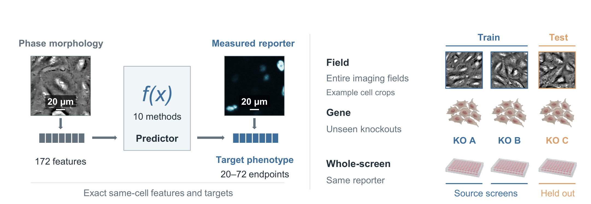
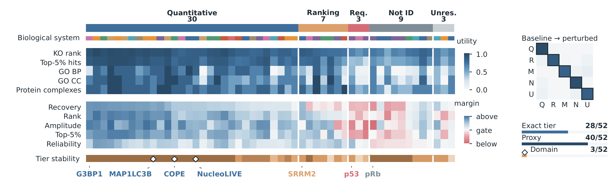
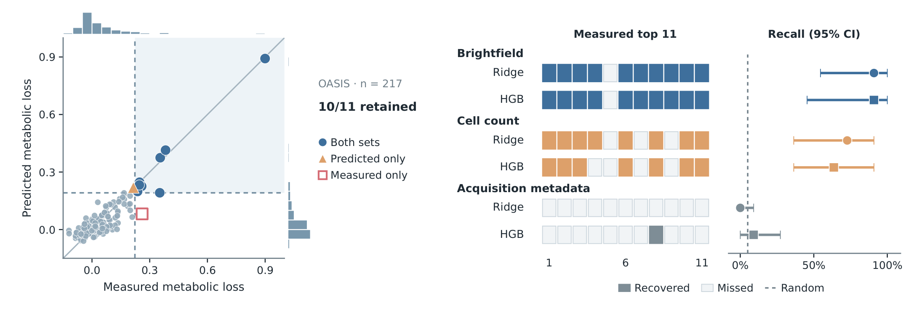
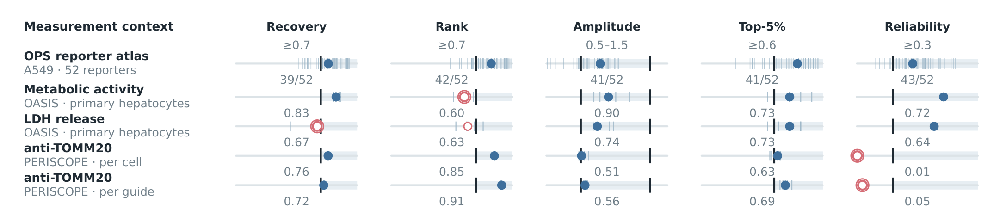

<a id="top"></a>

<div align="center">

<h1>MorphoSuff</h1>
<h3>Measurement sufficiency for cellular phenotypes</h3>

<p><b>What can a predicted measurement support?</b><br>
A Python toolkit for connecting morphology-based prediction to scientific use.</p>

<p>
  <a href="pyproject.toml"></a>
  <a href="LICENSE"></a>
  <a href="paper/manuscript.pdf"></a>
  <a href="https://huggingface.co/datasets/Amanda1998/MorphoSuff"></a>
</p>

<p>
  <a href="https://limengran98.github.io/MorphoSuff/"><b>Project page ↗</b></a> ·
  <a href="#quick-start"><b>Quick start</b></a> ·
  <a href="#your-data"><b>Use your data</b></a> ·
  <a href="#results"><b>Key results</b></a> ·
  <a href="#cross-dataset"><b>Across datasets</b></a> ·
  <a href="docs/README.md"><b>Documentation</b></a> ·
  <a href="#citation"><b>Cite</b></a>
</p>

</div>

**MorphoSuff** assesses whether a predicted cellular readout supports quantitative
response estimation, perturbation ranking or a specified downstream analysis.
It brings together **held-out prediction, target reproducibility and retained
scientific utility**, keeping the evidence behind each measurement decision
visible.

Use it with a new paired dataset or predictions from your own model. Dataset
adapters describe the experiment; shared analysis functions evaluate the
predictions and the uses they support.

<p align="center">
  <a href="paper/manuscript.pdf"></a>
  <br>
  <sub>Prediction and generalization in the OPS study · Figure 2a · <a href="paper/manuscript.pdf">Manuscript ↗</a></sub>
</p>

### From prediction to measurement decisions

| Generalization | Reference reliability | Scientific use |
| :--- | :--- | :--- |
| Does prediction recover responses to unseen perturbations or in a new screen? | Are the targeted responses reproducible across the relevant measurement replicates? | Are response magnitudes, candidate hits or functional conclusions retained? |

The assessment returns target-level evidence and decisions for the declared
**predictor, experimental context and intended use**.

<a id="installation"></a>
<a id="quick-start"></a>

## 🚀 Quick start

**Python 3.10+.** Install the package with its built-in tabular predictors and
Parquet support:

```bash
git clone https://github.com/limengran98/MorphoSuff.git
cd MorphoSuff
python -m pip install -e ".[sklearn,parquet]"
measurement-sufficiency --version
```

### Run an assessment on the included study evidence

Reapply the manuscript's reference rule to the 52 OPS reporter profiles.
This example uses the deposited prediction and reliability summaries, so it
needs **no atlas download or model training**. Run from the repository root:

```python
import pandas as pd
from measurement_sufficiency.analysis.tiers import tier_table

evidence = pd.read_csv(
    "paper/figure_sources/final/figure6/source_data/coherent_ensemble_evidence.csv"
).rename(columns={
    "reporter_slug": "reporter_id",
    "ensemble_recoverability_r": "recoverability_r",
    "magnitude_variance_ratio": "variance_ratio",
})

decisions = tier_table(
    evidence, group_columns=["reporter_id"], aggregate="none"
)
print(decisions["tier"].value_counts())
```

The result is **30 quantitative proxies, 7 ranking proxies, 3 requiring
measurement, 9 not identifiable and 3 unresolved**.
[Inspect the rule and evidence fields →](docs/adapt_new_dataset.md#5-assemble-evidence-and-assign-a-measurement-tier)

<details>
<summary><b>Environment setup and optional dependencies</b></summary>

For an isolated environment, run `python -m venv .venv`, activate it with
`source .venv/bin/activate` (Windows PowerShell: `.venv\Scripts\Activate.ps1`),
then run the installation command above.

| Workflow | Installation |
| :--- | :--- |
| Built-in Ridge, gradient boosting and MLP | `python -m pip install -e ".[sklearn]"` |
| External tabular examples and Parquet files | `python -m pip install -e ".[sklearn,parquet]"` |
| CatBoost predictors | `python -m pip install -e ".[catboost]"` |
| PyTorch predictors | `python -m pip install -e ".[torch]"` |
| Tabular model-suite dependencies | `python -m pip install -e ".[models]"` |
| Raw-image study workflows | `python -m pip install -e ".[image]"` |
| Paper figure rendering | `python -m pip install -e ".[figures]"` |

Study-specific model packages, weights and figure dependencies are documented
with their [adapters](docs/model_adapters.md),
[runners](docs/external_model_runners.md) and [figure sources](paper/figure_sources/README.md).

</details>

<a id="your-data"></a>

## Use MorphoSuff with your data

Choose the targeted readout, the scientific use and the unit to hold out.
Pairing may be at the cell or well level; reliability follows the experiment's
replicate structure.

| Starting point | Workflow |
| :--- | :--- |
| **Paired measurements** | Prepare observation metadata, input features and measured targets; define the split and fit a predictor. |
| **Your model's predictions** | Import measured and held-out predicted values with target, perturbation, screen and fold identifiers. |
| **An evidence table** | Supply recovery, magnitude ranking, variance ratio, hit recall and target reliability to the decision function. |

**[Prepare your dataset →](docs/adapt_new_dataset.md)** &nbsp;·&nbsp;
[Prediction schema](docs/adapt_new_dataset.md#3-fit-on-a-declared-split-or-import-predictions) &nbsp;·&nbsp;
[Model adapters](docs/model_adapters.md)

For a prediction table that includes matched controls, compute response fidelity
with the Python API:

```python
import pandas as pd
from measurement_sufficiency.analysis.response_fidelity import response_fidelity

predictions = pd.read_csv("predictions_fold0.csv")
fidelity = response_fidelity(predictions)

for name, table in fidelity.items():
    table.to_csv(f"fidelity_{name}.csv", index=False)
```

The output includes control-relative responses, response-magnitude ranks,
predicted-to-observed variance and strong-hit recall. Retain control predictions
within each evaluated screen and fold, and put target endpoints on a suitable
common scale. Add reliability from the relevant replicate measurements to
[assemble the decision evidence](docs/adapt_new_dataset.md#5-assemble-evidence-and-assign-a-measurement-tier).

<details>
<summary><b>Fit a reference predictor from your CSV tables</b></summary>

Prepare the [three input tables](docs/adapt_new_dataset.md#2-prepare-the-input-tables),
then run:

```bash
# Hold out perturbations and retain controls for response analysis.
measurement-sufficiency split gene observations.csv gene_split.csv \
  --folds 5 --seed 0 --control-column is_control

# Fit a Ridge predictor and export one held-out fold.
measurement-sufficiency run-fold \
  --inputs inputs.csv --targets targets.csv \
  --assignments gene_split.csv --split-name gene --fold 0 \
  --model ridge --features feature_001,feature_002 \
  --output predictions_fold0.csv

measurement-sufficiency validate-predictions predictions_fold0.csv
```

Replace the feature names and repeat `run-fold` for the remaining folds.
`gene` is the CLI name for a split by `perturbation_id`, including compounds.
The built-in fitting command supports `ridge`, `gbdt` and `mlp`; other
predictors can use the model adapters or export the same prediction schema.
See the [complete assessment workflow](docs/adapt_new_dataset.md#4-measure-prediction-and-response-fidelity)
for pooling, reliability estimation and decision criteria.

</details>

<a id="results"></a>

## 🔬 Selected results

### Different targets support different uses

In the OPS atlas, the ten-method median consensus supported quantitative
response criteria for 30 reporters and ranking criteria for another 7.
The evidence also identifies targets needing direct measurement and cases
where reliability or fidelity leaves the decision open.

<p align="center">
  <a href="paper/manuscript.pdf"></a>
  <br>
  <sub>Target-level evidence and decisions · Figure 6c · <a href="paper/figure_sources/final/figure6/c_decision_ledger/source_data/figure6c_decision_ledger_source.csv">Source data ↗</a></sub>
</p>

Each column represents one reporter. The right inset summarizes stability
across 36 threshold settings: “Proxy” counts reporters whose proxy/non-proxy
status remains unchanged.

| Decision | OPS reporters | Meaning under the reference rule |
| :--- | ---: | :--- |
| `quantitative_proxy` | 30 | Meets the declared response-recovery, ranking, amplitude-variance and hit-recall criteria |
| `ranking_proxy` | 7 | Preserves ranking and hit recall without meeting every quantitative criterion |
| `measurement_required` | 3 | Reliable reference measurements show insufficient recovery in the evaluated setup |
| `not_identifiable` | 9 | Low or unavailable reference reliability prevents a sufficiency decision |
| `unresolved` | 3 | Available evidence does not establish one of the other outcomes |

These cut-offs are reference operating points for the study. For a new
application, specify acceptance criteria from the intended decision and
relevant repeat measurements. Downstream hit or functional-analysis retention
is evaluated alongside response fidelity.

### Prioritize strong metabolic loss in primary hepatocytes

A brightfield-based Ridge predictor recovered **10 of the 11 largest measured
metabolic-activity losses among 217 held-out compounds**, selecting only 11
compounds for follow-up. Training used paired data from 868 other compounds;
all doses and sources of each test compound were held out.

<p align="center">
  <a href="paper/manuscript.pdf"></a>
  <br>
  <sub>A defined selection task and diagnostic comparisons · Figure 6d–e · <a href="paper/supplementary_data/SupplementaryData3/README.md">Predictions, source data and scoring replay ↗</a></sub>
</p>

The score is signed metabolic-activity loss relative to plate-matched controls,
averaged over eight concentrations. The adjacent comparison shows which hits
each predictor recovered and 95% compound-bootstrap intervals; cell counts
are fluorescence-derived diagnostic inputs. This focused use complements the
broader response-fidelity assessment by checking the selection decision itself.

<a id="cross-dataset"></a>

## One assessment workflow, different measurement settings

The study applies the shared analysis logic to three resources. Each uses
its own fitted predictors, pairing and replicate definitions.

| Resource | Biological system | Input → targeted readout | Pairing unit |
| :--- | :--- | :--- | :--- |
| **OPS** | A549 cells | Phase morphology → 52 reporters | Cell |
| **OASIS** | Primary human hepatocytes | Brightfield morphology → metabolic activity and LDH release | Well |
| **PERISCOPE** | A549 cells | Four Cell Painting channels → anti-TOMM20 features | Cell; also evaluated as guide profiles |

This separation of dataset preparation from assessment lets you evaluate a
new cell system or assay through the same evidence tables, with the input
modality and experimental design made explicit.

**[OASIS and PERISCOPE workflows →](studies/external/README.md)** &nbsp;·&nbsp;
[Adapt a new dataset →](docs/adapt_new_dataset.md)

<details>
<summary><b>See the cross-dataset response diagnostics</b></summary>

<p align="center">
  <a href="paper/manuscript.pdf"></a>
</p>

Figure 6f applies the study's reference response criteria in each context.
Reliability uses cell halves in OPS, well halves in OASIS and guide halves in
PERISCOPE. Red rings locate the first unmet criterion. PERISCOPE uses
fluorescent inputs; the OASIS response assessment uses CellProfiler features
and a different task from the brightfield-DINO prioritization above.
[Definitions and source data](paper/figure_sources/final/figure6/f_cross_context_decisions/figure_methods.md).

</details>

<a id="reproduce"></a>

## Documentation and reproducibility

| Goal | Entry point |
| :--- | :--- |
| **Use your own data** | [Dataset guide](docs/adapt_new_dataset.md) · [Model adapters](docs/model_adapters.md) |
| **Obtain the study data** | [Hugging Face release](https://huggingface.co/datasets/Amanda1998/MorphoSuff) · [Data access and contents](docs/data_code_availability.md) |
| **Reproduce an application** | [OASIS and PERISCOPE](studies/external/README.md) · [Metabolic-loss scoring](paper/supplementary_data/SupplementaryData3/README.md#reproduce-the-scoring) |
| **Reproduce the OPS analyses** | [Protocols](docs/ops_protocols.md) · [Data preparation](docs/ops_data_and_preparation.md) · [Model runners](studies/ops/runners/README.md) |
| **Read the study** | [Manuscript](paper/manuscript.pdf) · [Supplementary Information](paper/supplementary.pdf) · [Figures and source data](paper/README.md) |
| **Explore the package** | [Documentation index](docs/README.md) · [Contributing](CONTRIBUTING.md) |

<details>
<summary><b>Repository layout</b></summary>

```text
src/measurement_sufficiency/   Reusable Python package
studies/                      Dataset-specific preparation and analysis
configs/                      Model, split and analysis settings
docs/                         Usage guides and selected figure previews
reproducibility/               Data manifests and provenance tools
paper/                        Manuscript PDFs, figure code and compact source data
```

GitHub includes the compact tables used in the examples and figures. Registered
binary figure inputs are supplied with the tagged GitHub release; large training
arrays and representative fitted states are distributed through the
[companion data release](release/huggingface/README.md).

</details>

<a id="citation"></a>

## Citation and support

MorphoSuff accompanies **[When label-free morphology is sufficient for targeted
cellular measurements](paper/manuscript.pdf)**. Please cite the manuscript when
using the framework; [CITATION.cff](CITATION.cff) provides software citation
metadata. Cite the original datasets and external predictors used in your
analysis as well.

Study-owned code is released under the [MIT License](LICENSE). Source datasets
and third-party software retain their respective terms;
see [third-party notices](THIRD_PARTY_NOTICES.md).

For questions or reproducible bug reports, [open an issue](https://github.com/limengran98/MorphoSuff/issues)
with the package version, input schema and a minimal example.

---

<p align="center">
  <b>From prediction accuracy to scientific use.</b><br>
  <sub><a href="#top">Back to top ↑</a></sub>
</p>
